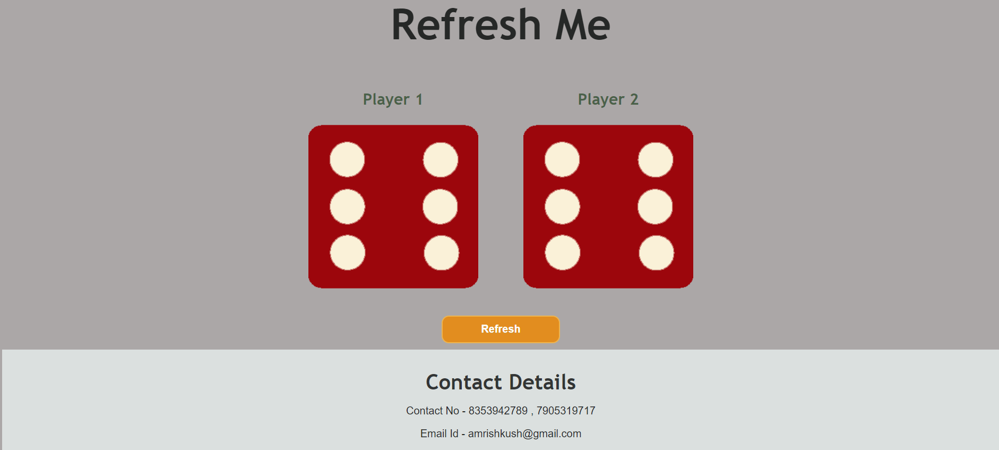

# DiceGame App

This project is a DiceGame App built with Javascript.

##  About Me
###  Hi, I'm Amrish! 👋
#### I'm a full stack developer[MERN]...

    

## Features

- Refresh to roll dice
- Player 1 and Player 2 
- It Shows random nos.

## Technologies Used

- Javascript
- HTML
- CSS

## Screenshot

## Demo

Click to Visit!
[DiceGame](https://amrishkush.github.io/Dicegame-html-css-js/)
